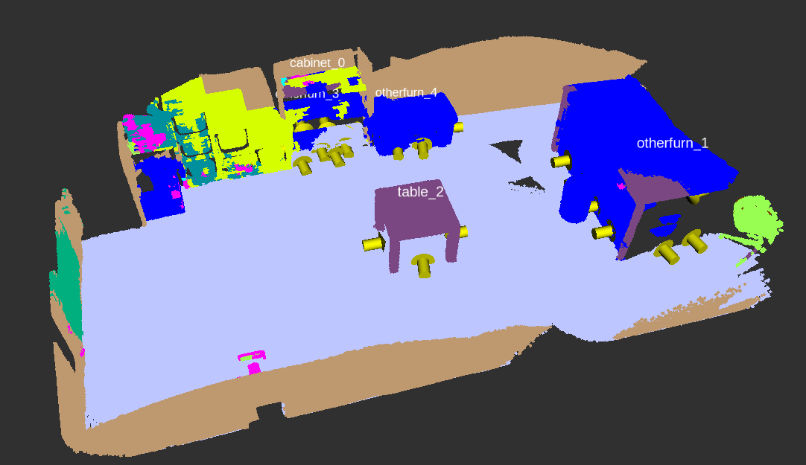

# Table Extractor

Finds areas of interest (horizontal planes, e.g. tables) in a semantically segmented reconstruction of the room. Those areas are saved in a database with [mongodb_store](http://wiki.ros.org/mongodb_store) as a [Table.msg](msg/Table.msg). The table_viewpoint.py script creates viewpoints around the edges of the plane and stores them in the database by updating the message.



## Dependencies

- mongodb_store
- ros_numpy
- tf_bag
- pyrsistent==0.16.1
- transforms3d==0.3.1
- open3d_ros_helper==0.2.0.3
- open3d==0.9.0.0
- scikit-image==0.14.5

A Dockerfile that installs the package and necessary dependencies is available. 

## Usage

Start mongodb first. Make sure `db_path` is set correctly. The standard port for mongodb_store is `62345`.
```
roslaunch --wait mongodb_store mongodb_store.launch db_path:=/home/v4r/mongo_db
```

Then you can run `table_extractor_script.py`. The path of the reconstruction file can be changed in the [config.yaml](./config.yaml), as well as other settings.
The colors parameter defines the colors of the classes from the semantic segmantation. Class_labels and class_names are only of those classes that are relevant, all the other ones are ignored.

`table_viewpoint.py` will read the message from the database, calculate the viewpoints and then update the message in the database with the viewpoints for every plane. 

`read_rosbag.py` will take a rosbag file that contains recordings of the rgb and depth topic, check if a plane is in the view of the camera and save the rgb and depth images that show a plane in view in a corresponding folder. This can then be used for the next reconstruction of the planes with objects in view. 

## Author
 - Markus Leitner (markus.j.leitner@tuwien.ac.at)

